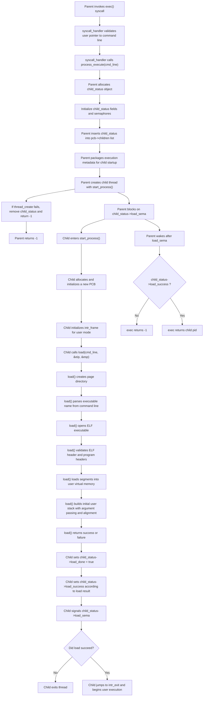
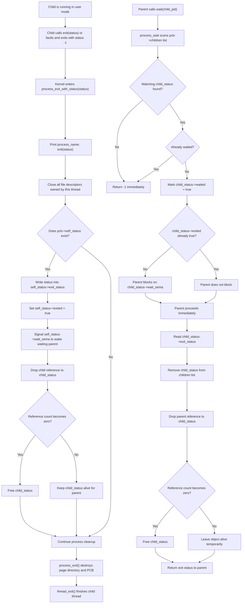

# Design

## 1. Problem

Project 1 transforms Pintos from a threads-only educational kernel into one that can safely execute user programs. The project requires the kernel to handle untrusted user memory, dispatch system calls, manage process creation and termination, preserve executable safety, support floating-point execution, and implement correct `fork()` semantics.

The difficulty of the project is not in any single feature, but in the interaction between features:

- pointer validation interacts with every syscall,
- `wait()` depends on process-lifetime management,
- read-only executable protection affects file handling,
- FPU support affects scheduling,
- and `fork()` depends on process state, file state, and register-state preservation.

## 2. Design Overview

The redesign followed four main architectural decisions:

### 2.1 Separate process state from thread state

A thread is a scheduling object; a process is an address-space and lifecycle object. Treating them as the same abstraction works only for the simplest cases and becomes fragile once `exec`, `wait`, `fork`, and floating-point state all coexist.

The final design therefore keeps:
- kernel scheduling identity in `struct thread`
- process lifetime and address-space ownership in `struct process`

### 2.2 Make parent-child lifecycle explicit

Instead of burying wait/exit behavior implicitly inside thread lifetime, the redesign introduced a dedicated `child_status` object. This object stores:
- child pid
- exit status
- startup success/failure flags
- wait semantics flags
- semaphores for synchronization
- reference count for safe lifetime management

This object is the central bridge between:
- parent waiting
- child exit
- child startup synchronization
- `exec()`
- `fork()`

### 2.3 Validate all user memory explicitly

Every pointer received from user space is treated as untrusted. Rather than relying on accidental page faults to enforce safety, the kernel validates:
- syscall argument locations
- user buffers
- C strings
- stack arguments

before dereferencing them.

### 2.4 Treat FPU state as part of thread context

Rather than special-casing floating-point syscalls, the final design stores floating-point state in the thread structure and preserves it across context switches exactly as the scheduler preserves execution state.

## 3. Key Data Structures

### 3.1 Process control block

```c
struct process {
  uint32_t *pagedir;              /* User page directory. */
  char process_name[16];          /* Process name. */
  struct thread *main_thread;     /* Main thread of the process. */

  struct list children;           /* List of child_status objects. */
  struct child_status *self_status; /* My status in my parent’s list. */
};
```
#### Role 
This object owns:
- the user page directory
- the parent-child list
- the process name
- the link back to the main thread

### 3.2 Child Lifecycle Object

```c
struct child_status {
  pid_t pid;
  int exit_status;
  bool exited;
  bool waited;
  bool load_done;
  bool load_success;

  struct semaphore wait_sema;
  struct semaphore load_sema;

  int ref_cnt;
  struct list_elem elem;
};
```
#### Role 
This object is shared between parent and child and supports:
- wait()
- exit-status transfer
- exec() load synchronization
- fork() startup synchronization
- safe deallocation through reference counting

### 3.3 File descriptor layer
```c
struct open_file {
  struct file *file;
  int ref_cnt;
};

struct file_descriptor {
  int fd;
  struct open_file *of;
  struct list_elem elem;
};
```
#### Role
This separates:
- per-process fd bindings
- shared underlying open-file state

This was necessary for correct fork() semantics, especially shared offset behavior.

### 3.4 Thread-level FPU archive
```c
uint8_t fpu_state[FPU_STATE_SIZE];
```
#### Role
Each thread owns an archived snapshot of its floating-point state. The scheduler saves and restores this archive during thread switches.

## 4. Execution Flow

### 4.1 Process Launch (`exec`) Flow Chart



### 4.2 Wait / Exit Flow Chart

### 4.3 fork() Flow Chart

```mermaid
flowchart TD
    A["Parent calls fork() syscall"] --> B["syscall_handler captures current intr_frame"]
    B --> C["syscall_handler calls process_fork(parent_if)"]
    C --> D["Parent allocates child_status"]
    D --> E["Initialize child_status fields including load_done/load_success"]
    E --> F["Parent allocates fork_info"]
    F --> G["fork_info stores parent intr_frame, parent thread, and child_status"]
    G --> H["Parent inserts child_status into pcb->children list"]
    H --> I["Parent creates child thread with start_fork()"]
    I --> J{"thread_create succeeded?"}
    J -->|No| K["Remove child_status, free metadata, return -1"]
    K --> Z1["fork returns -1 to parent"]

    J -->|Yes| L["Store child pid in child_status"]
    L --> M["Parent blocks on child_status->load_sema"]

    M --> N["Child enters start_fork(fork_info)"]
    N --> O["Child allocates and initializes new PCB"]
    O --> P["Child copies process_name from parent"]
    P --> Q["Child initializes empty children list and thread-level fd list"]
    Q --> R["Child duplicates parent page directory"]
    R --> S{"Address-space duplication succeeded?"}
    S -->|No| T["Set load_success = false and signal parent"]
    T --> U["Child exits thread"]

    S -->|Yes| V["Child duplicates file descriptor table"]
    V --> W{"FD table duplication succeeded?"}
    W -->|No| T["Set load_success = false and signal parent"]

    W -->|Yes| X["Child copies parent's saved intr_frame"]
    X --> Y["Child sets copied intr_frame.eax = 0"]
    Y --> Z["Child copies parent's FPU snapshot if needed"]
    Z --> AA["Child sets pcb->self_status = child_status"]
    AA --> AB["Child sets child_status->load_done = true"]
    AB --> AC["Child sets child_status->load_success = true"]
    AC --> AD["Child signals child_status->load_sema"]

    AD --> AE["Child jumps to intr_exit"]
    AE --> AF["Child resumes execution at same user instruction as parent"]
    AF --> AG["In child, fork() returns 0"]

    M --> BA["Parent wakes after load_sema"]
    BA --> BB["Parent checks child_status->load_done"]
    BB --> BC{"child_status->load_success ?"}
    BC -->|No| BD["Parent removes child_status and returns -1"]
    BC -->|Yes| BE["Parent returns child pid"]

    BE --> BF["In parent, fork() returns child's pid"]

```

### 4.4 Combined High-Level Overview
```mermaid
flowchart LR
    A["exec()"] --> B["Create child_status"]
    B --> C["Create child thread"]
    C --> D["Child loads ELF and stack"]
    D --> E["Child signals load result"]
    E --> F["Parent returns pid or -1"]

    G["exit() / fault"] --> H["Store exit status"]
    H --> I["Signal wait_sema"]
    I --> J["Cleanup process resources"]

    K["wait(pid)"] --> L["Find child_status"]
    L --> M["Block until child exits if needed"]
    M --> N["Collect exit status"]
    N --> O["Free lifecycle object when refcount reaches zero"]

    P["fork()"] --> Q["Create child_status and fork_info"]
    Q --> R["Create child thread"]
    R --> S["Child duplicates address space and fd table"]
    S --> T["Child sets eax = 0 and signals parent"]
    T --> U["Parent returns child pid"]