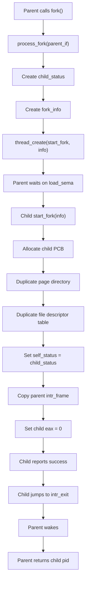

```mermaid
flowchart TD
    A["Parent calls fork()"] --> B["process_fork(parent_if)"]
    B --> C[Create child_status]
    C --> D[Create fork_info]
    D --> E["thread_create(start_fork, info)"]
    E --> F[Parent waits on load_sema]

    F --> G["Child start_fork(info)"]
    G --> H[Allocate child PCB]
    H --> I[Duplicate page directory]
    I --> J[Duplicate file descriptor table]
    J --> K[Set self_status = child_status]
    K --> L[Copy parent intr_frame]
    L --> M[Set child eax = 0]
    M --> N[Child reports success]
    N --> O[Child jumps to intr_exit]

    O --> P[Parent wakes]
    P --> Q[Parent returns child pid]
```
For the full detailed control flow, see design.md