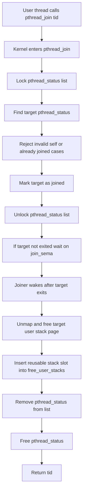

# `project2-threads/diagrams/thread-join.md`

# Thread Join Flow

```mermaid
flowchart TD
    A[User thread calls pthread_join tid] --> B[Kernel enters pthread_join]
    B --> C[Lock pthread_status list]
    C --> D[Find target pthread_status]
    D --> E[Reject invalid self or already joined cases]
    E --> F[Mark target as joined]
    F --> G[Unlock pthread_status list]
    G --> H[If target not exited wait on join_sema]
    H --> I[Joiner wakes after target exits]
    I --> J[Unmap and free target user stack page]
    J --> K[Insert reusable stack slot into free_user_stacks]
    K --> L[Remove pthread_status from list]
    L --> M[Free pthread_status]
    M --> N[Return tid]
```